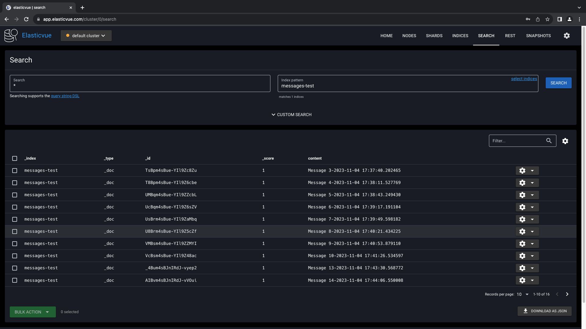

1. What this code does ?
- There are two main components in this application:
    1. **Producer**: Responsible for generating a sequence of messages (e.g., `Message 1, 2, etc.`) and sending them to a Kafka topic named `test-topic`.
    2. **Consumer**: Responsible for consuming messages from the `test-topic`. After consuming the message from the Kafka topic, the consumer performs two actions:
         - Inserts the record with datetime in an Elasticsearch index named `test-index`.
         - Inserts the message in a Neo4j graph database as a node.

2. Description to deploy the application as a Kubernetes deployment, and service for each component.
- Created deployment for each container inside k8s folder.
- Created service for elasticsearch, neo4j, and kafka.
  - ES service is NodePort type, so we can access it from outside the cluster.
  - Neo4J service is NodePort type, so we can access it from outside the cluster.
  - Kafka service is ClusterIP type, so we can access it from inside the cluster.
- Created secrets to store credentials for each component.
- Created configmaps to store configuration for each component.
- Created Persistent volume and Persistent volume claim for Neo4J

- To automate this deployment I created small script to deploy all the components at once.
  - `./dev.sh deploy_cluster` to deploy the cluster.

3. How would I use logs messages to debug pipeline?
- Each component has its own INFO/ERROR/WARNING logs, it shows all warnings and errors in that container. For example in producer and consumer application it shows the messages that are being sent and received and shows if it is able to pass message to ES or Neo4J. If not then based on exeception message we can debug the issue.``

--------
Screenshots for the deployment and the services.
--------
  - *Kubernates info of each service and deployment.*
  - 

  - *Logs of the running application.*
  - 
  - 

  - *ElasticSearch*
  - 
  - 
  - 

  - *Neo4J*
  - 

  - *Kafka Between components*
  - 